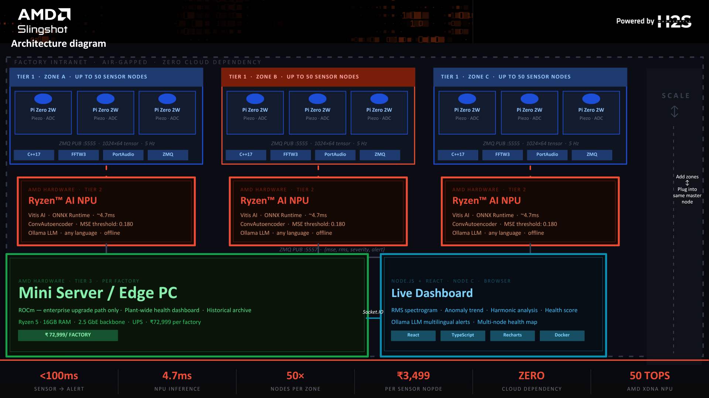

# Resonance

Offline, physics-first vibration intelligence system for SME industrial machinery.
Detects bearing wear, misalignment, cavitation, and imbalance before catastrophic failure.

Built on AMD Ryzen AI edge hardware. Zero cloud dependency. Alerts in Hindi, Marathi, English.

---

## System Architecture



```
Host Machine
└── Node A (C++ DSP)
      Subscribes: USB Audio (44.1kHz)
      Publishes:  ZMQ tcp://*:5555  [1024×64 spectrogram tensor]

Docker Network
├── Node B (Python Inference)
│     Subscribes: ZMQ :5555
│     Publishes:  ZMQ :5557  {mse, rms, severity, alert}
│     Runtime:    ONNX Runtime (CPU dev) · Vitis AI (NPU target)
│
├── Web (Node.js + React Dashboard)
│     Subscribes: ZMQ :5557
│     Serves:     http://localhost:3001
│
└── LLM (Mistral 7B — Optional)
      Serves: :11434 via Ollama (local only, no cloud API)
```


---

## Repository Structure

```
Resonance/
├── src/                          # Node A — C++ DSP Engine
│     ├── main.cpp
│     ├── ear.cpp                 # PortAudio input capture
│     ├── fft.cpp                 # FFTW3 FFT processing
│     ├── filters.cpp             # High-pass / low-pass filters
│     ├── spectrogram.cpp         # Log-magnitude spectrogram
│     ├── broadcaster.cpp         # ZMQ PUB :5555
│     └── safety.cpp              # RMS safety gate
│
├── include/resonance/            # C++ header files
│     ├── ear.hpp
│     ├── fft.hpp
│     ├── filters.hpp
│     ├── spectrogram.hpp
│     ├── broadcaster.hpp
│     └── safety.hpp
│
├── python/
│     ├── inference/
│     │     └── main.py           # Node B — ONNX inference + LLM alerts
│     ├── llm/
│     │     └── handler.py        # LLMProvider → LocalLLM → LLMHandler
│     ├── training/
│     │     ├── collect_data.py   # Healthy baseline collection
│     │     ├── dataset.py        # Spectrogram dataset loader
│     │     ├── model.py          # ConvAutoencoder architecture
│     │     ├── train.py          # Training loop
│     │     └── export_onnx.py    # PyTorch → ONNX export
│     ├── onnx/
│     │     ├── autoencoder.onnx  # Deployed model
│     │     └── model_hash.txt    # SHA-256 integrity hash
│     ├── weights/
│     │     ├── autoencoder.pth   # PyTorch checkpoint
│     │     └── norm_stats.json   # Normalization parameters
│     ├── utils/
│     │     ├── config.py         # Thresholds, ZMQ endpoints, LLM config
│     │     ├── zmq_receiver.py   # ZMQ subscriber
│     │     ├── rms_monitor.py    # Standalone RMS visualizer
│     │     └── dsp.py            # DSP utilities
│     ├── tests/
│     │     ├── mock_node_a.py    # ZMQ mock publisher for testing
│     │     └── evaluate_model.py # MSE threshold evaluation
│     ├── run_inference.py        # Entry point
│     ├── requirements.txt
│     ├── Dockerfile
│     └── README.md
│
├── web/                          # Node C — React Dashboard
│     ├── app/                    # React components + hooks
│     ├── styles/                 # CSS + Tailwind
│     ├── server.js               # Node.js relay (ZMQ → Socket.IO)
│     ├── index.html
│     ├── package.json
│     ├── vite.config.ts
│     └── Dockerfile
│
├── schema/                       # Data schemas
├── docker-compose.yml
├── runall.sh                     # Start all services locally
├── CMakeLists.txt
└── README.md
```

---

## Hardware Requirements

### Target Deployment
- Tier 1 — Raspberry Pi Zero 2W · USB Audio Adapter (C-Media CM108 compatible) · Piezo disc 35mm
- Tier 2 — AMD Ryzen AI Mini PC · XDNA NPU · 50 TOPS · Vitis AI Runtime
- Tier 3 — Ryzen 5 Edge Mini PC · Node.js dashboard · PostgreSQL archive

### Development Mode
- Any Linux machine with Docker installed
- USB audio adapter or built-in microphone
- Node A validated on x86 — Pi Zero 2W deployment target

### Sensor BOM (Tier 1)
| Component | Spec | Cost |
|---|---|---|
| Raspberry Pi Zero 2W | Quad-core ARM 1GHz 512MB | ₹1,299 |
| USB Audio Adapter | C-Media CM108 44.1kHz | ₹299 |
| Piezo Disc 35mm | PZT ceramic contact | ₹80 |
| 1.2MΩ Bias Resistor | 1/4W carbon film | ₹2 |
| 1µF Capacitor | 25V electrolytic DC block | ₹8 |
| 2N3819 JFET Buffer | N-ch TO-92 impedance match | ₹20 |
| **Total BOM** | | **₹2,491** |

---

## Run Without Docker

### Step 1 — Build Node A (C++ DSP)

```bash
git clone https://github.com/HSKCTA/Resonance.git
cd Resonance
mkdir build && cd build
cmake ..
make
./resonance_node_a
```

Node A begins publishing spectrograms on ZMQ tcp://*:5555.

### Step 2 — Run Node B (Inference)

```bash
cd python
pip install -r requirements.txt
python run_inference.py
```

Node B subscribes to :5555 and publishes results on :5557.

### Step 3 — Run Dashboard

```bash
cd web
npm install
npm run dev
```

Dashboard available at http://localhost:5173

### Or use the launcher script

```bash
./runall.sh        # starts all 5 services
./runall.sh stop   # stops everything
```

---

## Run With Docker (Recommended)

### Step 1 — Start Node A on host

Node A must run on host to access USB audio hardware:

```bash
cd build
./resonance_node_a
```

### Step 2 — Start all containers

```bash
docker compose up --build
```

This starts Node B (inference), Web (dashboard), and the Ollama LLM container.

### Step 3 — Open dashboard

```
http://localhost:3001
```

### LLM Alerts (Optional)

Pull Mistral 7B for local multilingual fault explanations:

```bash
docker exec -it resonance_ollama ollama pull mistral:7b
```

If not pulled, system runs with fallback rule-based alert text.
LLM delivers fault explanations in English, Hindi, and Marathi.

---

## Signal Pipeline

```
Piezo Sensor
     │
     ▼
PortAudio (44.1kHz capture)
     │
     ▼
High-Pass Filter (100Hz) + Low-Pass Filter (12kHz)
     │
     ├── RMS Amplitude → Safety Gate (ISO 10816 threshold)
     │         └── HARDWARE ALARM if RMS > threshold (bypasses AI)
     │
     ▼
FFTW3 (2048-pt FFT · 75% overlap)
     │
     ▼
Log-Magnitude Spectrogram [1024 × 64]
     │
     ▼
ZMQ PUB :5555
     │
     ▼
ConvAutoencoder (ONNX Runtime · CPU / AMD Ryzen AI NPU)
     │
     ▼
MSE Reconstruction Error
     │
     ├── MSE > 0.180 → ANOMALY DETECTED
     │         └── Mistral 7B LLM → alert in Hindi / Marathi / English
     │
     └── MSE ≤ 0.180 → NORMAL
```

---

## Fault Detection Science

Industrial faults produce specific spectral signatures detectable weeks before failure:

| Fault Type | Spectral Signature | Detection Method |
|---|---|---|
| Bearing Wear | High-frequency harmonics >5kHz | Autoencoder MSE |
| Misalignment | Strong 2× 3× shaft frequency peaks | FFT harmonic analysis |
| Looseness | Frequency sidebands | Spectral analysis |
| Imbalance | Large 1× shaft frequency peak | RMS safety gate |

Standards compliance: ISO 10816-3:2009 · ISO 13373-1:2002

---

## Model Card

| Property | Value |
|---|---|
| Architecture | Convolutional Autoencoder |
| Input | 1024×64 log-magnitude spectrogram |
| Training data | Healthy vibration only (unsupervised) |
| Loss function | Mean Squared Error (MSE) |
| Anomaly threshold | 0.180 (calibrated on healthy baseline data) |
| Export format | ONNX |
| Runtime | ONNX Runtime (CPU) · Vitis AI (NPU target) |
| Inference latency | ~4.7ms (AMD Ryzen AI NPU) |
| Parameters | ~180K |

### Normalization
Min-max normalization applied before inference.
Parameters stored in `python/weights/norm_stats.json`.
Must be regenerated if sensor hardware changes — run `collect_data.py` then `train.py`.

### Limitations
- Trained on small healthy dataset — retrain on target machine for best results
- Single fault type detection — fault classifier roadmap Q2 2026
- Threshold calibrated manually — adaptive threshold planned

---

## Evaluation

```bash
cd python
python tests/evaluate_model.py
```

Reports MSE distribution on training data and recommended threshold.

### Spectrogram Parameters
| Parameter | Value |
|---|---|
| Sample rate | 44,100 Hz |
| FFT size | 2048 points |
| Overlap | 75% |
| Frequency bins | 1024 |
| Time steps | 64 |
| Output shape | [1, 1024, 64] |

---

## Benchmarks

| Environment | Inference Latency | End-to-End Latency |
|---|---|---|
| AMD Ryzen AI XDNA NPU (target) | ~4.7ms | <100ms |
| x86 CPU dev machine | ~18-25ms | <200ms |

End-to-end: sensor capture → DSP → ZMQ → inference → alert publish.

---

## Privacy and Deployment

- No audio data leaves the local network
- Human voice range (80Hz–3kHz) filtered before AI layer — conversations never processed
- No cloud dependency for core inference
- Air-gapped factory deployment supported
- LLM runs locally via Ollama — no external API calls in production
- Read-only system — never sends control commands to machinery

---

## Cost

| Tier | Hardware | BOM Cost | Deploy Price |
|---|---|---|---|
| Tier 1 — Sensor Node | Pi Zero 2W + Piezo | ₹2,491 | ₹3,499 |
| Tier 2 — NPU Zone | AMD Ryzen AI Mini PC | ₹81,296 | ₹89,999 |
| Tier 3 — Master Node | Ryzen 5 Edge Mini PC | ₹64,996 | ₹72,999 |
| **20-machine SME** | 2 zones + 1 master | — | **₹3,47,977** |

SKF equivalent: ₹9,00,000 hardware + ₹2,00,000/yr cloud.
Resonance: 85% cheaper. Zero cloud cost.

---

## Roadmap

| Phase | Timeline | Feature |
|---|---|---|
| Q1 2026 | Now | ConvAutoencoder · batched NPU inference · 50 sensors/zone |
| Q2 2026 | 3 months | Fault type classifier — bearing vs imbalance vs looseness |
| Q3 2026 | 6 months | Remaining useful life estimator — LSTM on MSE trend |
| Q4 2026 | 12 months | Multi-factory dashboard · SCADA integration · AMD EPYC |

---

## License

MIT License — see LICENSE file.

---

## Team

**Hitesh Khare** — Systems Engineering · C++ DSP Core
**Tanmay Bhole** — AI/ML Architecture · Model Training · GenAI

AMD Slingshot 2026 · Team H2S
